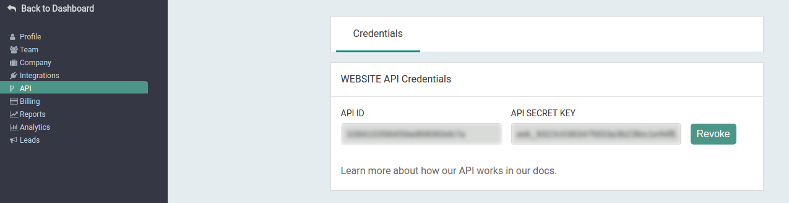

# Riminder Api C#

-------------------------------------

A c# api client for riminder api.

## Instalation with nuget
```shell
dotnet add package riminder
```

## Authentification
To authenticate against the api, get your API SECRET KEY from your riminder dashboard: 


Then create a new `Riminder.Riminder` object with this key:
```c#
using Riminder;

// Authentification to api
var client = new Riminder("yoursecretkey");

// Finally you can use the api!!.
```

## Api Overview
```
using System;
using Riminder;

var client = new Riminder("some-key");

// Let's retrieve a profile.
var profile = client.profile.get("source_id", profile_reference:"reference_for_a_profile");

// And print his name !
Console.WriteLine("This profile name is: ");
Console.WriteLine(profile.name");

```

## Errors
If an error occurs while an operation an exception inherited from `Riminder.exp.RiminderException` is raised.

## Api
The mentionned team is the team linked to your secret key.

When both `*_id` and `*_reference` arguments are requested only one is requiered. 
For example `client.filter.get()` can take a
* `filter_id` (`client.filter.get(filter_id: var_filter_id)`)  
* `filter_reference` (`client.filter.get(filter_reference: var_filter_reference`) 

and work as well.

All methods return structures which attribute are public and match json keys. Only the `data` field will be returned.
For example: `{"code": 200, "message: "All green.", "data": {"name": "Natalie"}}` would become
```c#
public class ExampleStruct: IResponse
{
    public string name;
}
```

For details and examples see [our documentation](https://developers.Riminder.net/v1.0/reference).

### Filter

* Get all filters from the team.
```c#
Riminder.response.FilterList resp = client.filter.list();
```

* Get a specific filter.
```c#
Riminder.response.Filter_get resp = client.filter.get(filter_id, filter_reference);
```

More details about filters are available [here](https://developers.Riminder.net/v1.0/reference#jobs)

### Profile

* Retrieve the profiles information associated with specified source ids.
    * `source_ids` (`List<string>`) is *requiered*.
    * `date_start` and `date_end` type are `long`.
    * `page`,  `rating` and `limit` type are `int`.
```c#
Riminder.response.ProfileList resp = client.profile.list(source_ids,
 date_start, date_end, 
 page, limit , seniority, 
 filter_id, filter_reference, 
 stage, rating, 
 sort_by, order_by);
```

* Add a new profile to a source on the platform.
    * `source_id` and `file_path` are *requiered*
    * `file_path` is the path to the file to be uploaded.
    * `training_metadatas` type is `response.TrainingMetadatas` (`response/struct.cs`)
```c#
Riminder.response.Profile_post resp = client.profile.add(source_id, file_path, profile_reference, timestamp_reception, training_metadatas);
```

* Get a specific profile.
```c#
Riminder.response.Profile_get resp = client.profile.get(source_id, profile_id, profile_reference);
```

* Get attachements of a specific profile.
```c#
Riminder.response.ProfileDocument_list resp = client.profile.documents.list(source_id, profile_id, profile_reference);
```

* Get parsing result of a specific profile.
```c#
Riminder.response.ProfileParsing resp = client.profile.parsing.get(source_id, profile_id, profile_reference);
```

* Get scoring result of a specific profile.
```c#
Riminder.response.ProfileScoringList resp = client.profile.scoring.list(source_id, profile_id, profile_reference);
```

* Set stage of a specific profile for a spcified filter.
    * `stage` is requiered.
```c#
Riminder.response.ProfileStage resp = client.profile.stage.set(source_id, stage, profile_id, profile_reference, filter_id, filter_reference);
```

* Set rating of a specific profile for a spcified filter.
    * `rating` (`int`) is requiered.
```c#
Riminder.response.ProfileRating resp = client.profile.stage.set(source_id, rating, profile_id, profile_reference, filter_id, filter_reference);
```

* Check if a parsed profile is valid.
    * `profile_data` (`Riminder.response.ProfileJson`) is the parsed profile you want to check, can be called "profile_json".
    * `training_metadata` type is (`Riminder.response.TrainingMetadatas`)
```c#
Riminder.response.ProfileJsonCheck resp = client.json.check(profile_data, training_metadata);
```

* Add a parsed profile to a source on the platform.
    * `profile_data` (`Riminder.response.ProfileJson`) is the parsed profile you want to add, can be called "profile_json".
    * `training_metadata` type is (`Riminder.response.TrainingMetadatas`)
```c#
Riminder.response.ProfileJson_post resp = client.json.add(source_id, profile_reference, timestamp_reception, profile_data, training_metadata);
```

More details about profiles are available [here](https://developers.Riminder.net/v1.0/reference#profile)

### Sources

* Get all source from the team.
```c#
Riminder.response.SourceList resp = client.source.list();
```

* Get a specific filter.
```c#
Riminder.response.Source_get resp = client.source.get(source_id);
```

More details about profiles are available [here](https://developers.Riminder.net/v1.0/reference#source)

### Webhooks

Webhooks methods permit you handle webhook events.

* Check if team's webhook integration is working.
```c#
Riminder.response.WebhookCheck resp = client.webhooks.check();
```
* Set an handler for a specified webhook event.
    * `handler` (`Riminder.route.Webhook.WebhookHandler`) is a delegate of signature: `void WebhookHandler(string eventName, response.IWebhookMessage webhook_data)` 
        * data received by the webhook are store in `webhook_data`. 
        * `webhook_data` struct follow the same rules as the responses.
        * `eventName` is `type` field of the webhook.

```c#
client.webhooks.setHandler(Riminder.route.webhook.EventNames.PROFILE_PARSE_SUCCESS, handler);
```
* Check if there is an handler for a specified event
```c#
client.webhooks.isHandlerPresent(eventName);
```
* Remove the handler for an event
```c#
client.webhooks.removeHandler(eventName);
```
* Start the selected handler depending of the event given.
    * `headers` is webhook request headers.
    * `signatureHeader` is webhook request "HTTP-RIMINDER-SIGNATURE" header value.
        * One them is requiered not both.
```c#
client.webhooks.handle(headers, signatureHeader)
```
Example: 
```c#
using System;
using Riminder;
using Riminder.route;

public class Example
{
    static void Main()
    {
        var client = new Riminder("apikey");

        // Define an handler
        var handler = delegate (string eventName, response.IWebhookMessage webhook_data) { /* something */};

        // Set the handler for an event
        client.webhooks.setHandler(Webhook.EventNames.PROFILE_PARSE_SUCCESS, handler);

        // Get the header of the request by webhook
        var rcvheaders = fct_that_get_webhook_request();

        // Handle an event
        client.webhooks.handle(headers: rcvheaders);
    }
}
```

More details about webhooks are available [here](https://developers.Riminder.net/v1.0/reference#authentication-1)

## Tests

Some tests are available. To run them follow these steps:
* `git clone git@github.com:Riminder/csharp-riminder-api.git`
* `cd csharp-riminder-api/riminder.Tests`
* `dotnet test`

## Help and documentation
If you need some more details about the api methods and routes see [Riminder API Docs](https://developers.Riminder.net/v1.0/reference).

If you need further explainations about how the api works see [Riminder API Overview](https://developers.riminder.net/v1.0/docs/website-api-overview) 